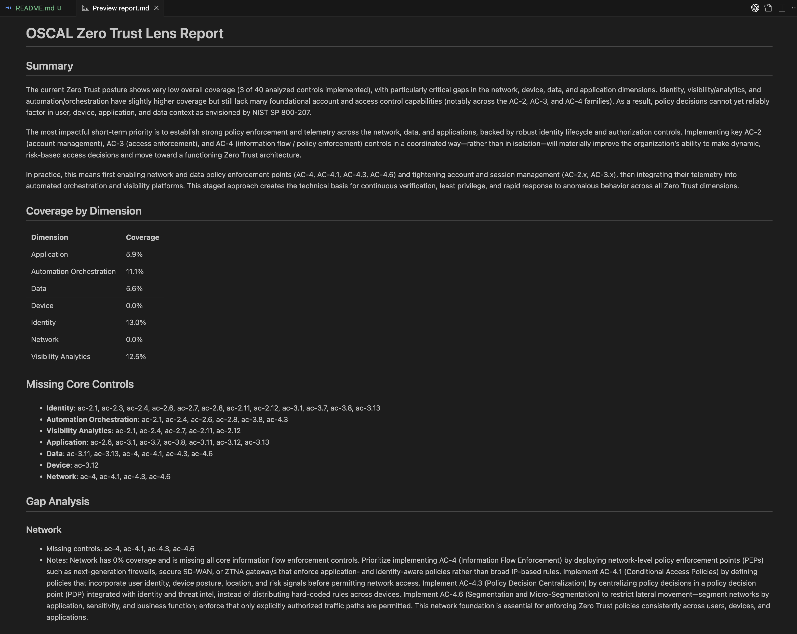

# oscal-zero-trust-lens 🔍🛡️
[](https://opensource.org/licenses/Apache-2.0)
[](https://www.python.org/downloads/)
[](https://langchain-ai.github.io/langgraph/)
[](https://pages.nist.gov/OSCAL/)
[](https://github.com/usnistgov/oscal-content)
[](https://langchain-ai.github.io/langgraph/)
[](https://pages.nist.gov/OSCAL-Reference/)

**OSCAL → Zero Trust lens.**  
Given an OSCAL catalog/profile and a system SSP, classify controls into Zero Trust
dimensions and see where your Zero Trust posture is strong or weak.

Inspired by:

- [NIST SP 800-53 Rev. 5](https://csrc.nist.gov/pubs/sp/800/53/r5/upd1/final) and its OSCAL representations.
- [NIST SP 800-207](https://csrc.nist.gov/pubs/sp/800/207/final) Zero Trust Architecture.
- The OSCAL content/examples from [`usnistgov/oscal-content`](https://github.com/usnistgov/oscal-content).

## What it does (v0)

- Loads the NIST SP 800-53 Rev. 5 OSCAL catalog (JSON).
- Uses an LLM to classify each control into:
  - Zero Trust **dimensions**: identity, device, network, application, data,
    visibility/analytics, automation/orchestration.
  - Zero Trust **criticality**: core / supporting / optional.
- Loads an OSCAL SSP and marks which controls are implemented.
- Produces a **Zero Trust coverage report**:
  - coverage % per dimension (based on controls in scope),
  - missing **core** controls per dimension,
  - narrative gap analysis.

All orchestrated as a **LangGraph** pipeline with multiple agents.



## Zero Trust Dimensions (NIST SP 800-207)

| Dimension | Description |
|-----------|-------------|
| **identity** | User/service identity, authentication, MFA |
| **device** | Device posture, health, compliance |
| **network** | Micro-segmentation, network controls |
| **application** | App-level security, secure access |
| **data** | Data protection, encryption, classification |
| **visibility_analytics** | Logging, monitoring, threat detection |
| **automation_orchestration** | Policy automation, SOAR, response |

## Pipeline Architecture

```
┌─────────────────┐     ┌─────────────────┐     ┌─────────────────┐
│  ClassifierAgent│────▶│  SSPMapperAgent │────▶│ GapAnalyzerAgent│
│                 │     │                 │     │                 │
│ Classify each   │     │ Load SSP, mark  │     │ Compute coverage│
│ control into ZT │     │ which controls  │     │ per dimension,  │
│ dimensions &    │     │ are implemented │     │ identify gaps   │
│ criticality     │     │                 │     │                 │
└─────────────────┘     └─────────────────┘     └─────────────────┘
```

## Quickstart

```bash
# Clone the repo
git clone https://github.com/<you>/oscal-zero-trust-lens.git
cd oscal-zero-trust-lens

# Add OSCAL content as submodule
git submodule add https://github.com/usnistgov/oscal-content.git data/oscal-content
git submodule update --init --recursive

# Install dependencies
pip install -e .

# Example test runs
python -m oscal_zt.cli \
  --catalog data/oscal-content/nist.gov/SP800-53/rev5/json/NIST_SP-800-53_rev5_catalog.json \
  --ssp data/ssp/demo-ssp.json \
  --json --verbose --save-lens

python -m oscal_zt.cli --json > report.json

# Markdown report
python -m oscal_zt.cli --markdown           # to stdout
python -m oscal_zt.cli --markdown report.md # write to file
Markdown format includes:
- H1 title and Summary section
- Coverage by dimension (table)
- Missing core controls (bulleted per dimension)
- Gap analysis (per-dimension notes and missing controls)

***
# or: pip install -U langgraph langchain langchain-community langchain-openai pydantic

# Set your API key
export OPENAI_API_KEY=sk-...
python -m oscal_zt.cli
```

## Sample Output

```
=== Zero Trust Coverage by Dimension ===
- identity: 45.2%
- device: 23.1%
- network: 67.8%
- data: 34.5%
- visibility_analytics: 89.0%
- automation_orchestration: 12.3%

=== Missing Core Controls (sample, from first batch) ===
- identity: ac-2, ia-2, ia-5
- device: cm-8, si-4
- data: sc-8, sc-28

=== Summary ===
Your Zero Trust posture shows strong visibility/analytics coverage but 
significant gaps in automation/orchestration and device management...

=== Detailed Gaps ===

[identity] missing: ac-2, ia-2, ia-5
  Critical identity controls are not implemented. Consider prioritizing 
  multi-factor authentication (IA-2) and account management (AC-2).
```

## Project Structure

```
oscal-zero-trust-lens/
├── README.md
├── pyproject.toml
├── .env.example
├── data/
│   ├── oscal-content/      # git submodule: usnistgov/oscal-content
│   ├── zt_lens/
│   │   └── zt-lens-800-53.json  # cached lens annotations
│   └── ssp/
│       └── demo-ssp.json
└── src/
    └── oscal_zt/
        ├── __init__.py
        ├── config.py
        ├── models.py
        ├── oscal_loader.py
        ├── lens_store.py
        ├── graph.py
        ├── cli.py
        └── agents/
            ├── __init__.py
            ├── classifier.py
            ├── ssp_mapper.py
            └── gap_analyzer.py
```

## Configuration

| Environment Variable | Default | Description |
|---------------------|---------|-------------|
| `OPENAI_API_KEY` | (required) | Your OpenAI API key |
| `OPENAI_MODEL` | `gpt-5` | Model to use for classification |

## Roadmap

- [ ] Classify the full 800-53 catalog and persist the lens to `data/zt_lens/zt-lens-800-53.json`
- [ ] Accept arbitrary OSCAL **profiles** and **SSPs** from the command line
- [ ] Add a simple web UI to visualize Zero Trust coverage radar-style
- [ ] Integrate with `oscal-agent-lab` and `oscal-digital-twin-playground`:
  - Use the ZT lens to prioritize which drifts/mitigations are most important
    from a Zero Trust perspective

## References

- [NIST SP 800-53 Rev. 5](https://csrc.nist.gov/pubs/sp/800/53/r5/upd1/final) - Security and Privacy Controls
- [NIST SP 800-207](https://csrc.nist.gov/pubs/sp/800/207/final) - Zero Trust Architecture
- [OSCAL](https://pages.nist.gov/OSCAL/) - Open Security Controls Assessment Language
- [usnistgov/oscal-content](https://github.com/usnistgov/oscal-content) - Official OSCAL examples

## License

Apache 2.0
